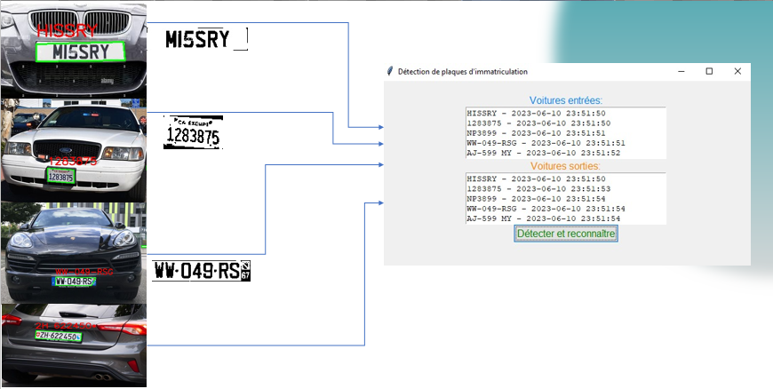

<h1  align="center"> OpenCV and OCR for Parking Management.</h1>

<h1 align="center">Abstract</h1>
The project aims to automate parking management by recording the entry and exit dates of vehicles. This is achieved using OpenCV and OCR (Optical Character Recognition) technology. With this approach, the system is able to scan the license plates of vehicles and read the
corresponding characters using OCR. As a result, the information regarding the entry and exit dates is automatically extracted, enabling more efficient parking management.


<h1 align="center">GENERAL INTRODUCTION</h1>
<p>
n the field of computer science and computer vision, the OpenCV (Open Source Computer Vision Library) technology has revolutionized the way machines interact with the visual world around them. OpenCV provides a set of powerful tools and libraries for processing and analyzing images and videos in real-time. One of the most relevant applications of computer vision is Optical Character Recognition (OCR), which enables the conversion of textual data present in images or videos into digital text.

Within the scope of our parking management project, we harness the capabilities of OpenCV and OCR to automate and enhance the vehicle tracking process. Traditionally, parking management requires manual entry of information such as license plate numbers and entry and exit dates of vehicles. However, this approach has limitations in terms of time, accuracy, and human cost. By using OpenCV and OCR, we are able to scan the license plates of vehicles entering or exiting the parking area. OpenCV provides us with advanced features to detect, extract, and preprocess information from license plate images. Once the images are captured, OCR comes into play to recognize and convert the characters on the license plate into computer-readable text.

The integration of these technologies into our project automates the vehicle tracking process. Information regarding the entry and exit dates of vehicles is accurately and efficiently extracted, thus eliminating potential errors associated with manual data entry. This greatly facilitates parking management, reducing the time and resources required to record and track vehicle movements.

  
</p>


<h1 align="center">Project Presentation</h1>
<h2>Problem Statement</h2>

The parking management project utilizing OpenCV and OCR aims to address several challenges encountered in traditional parking management systems. The key challenges we face include:
<ol>
  
<li>Manual Data Entry: Traditional parking management methods require manual entry of information such as license plate numbers and entry/exit dates of vehicles. This demands dedicated personnel and is prone to transcription errors, leading to inconsistencies in recorded data.
</li>
<li>Time and Efficiency: The manual data entry process can be slow and inefficient, especially in high-traffic parking lots. Queues can grow, causing delays and an unsatisfactory customer experience.
</li>
<li>Human Cost: Employing personnel for manual data entry adds an extra cost for parking operators. By automating this process, we can reduce expenses related to human resources.
</li>
<li>Accuracy and Reliability: Manual entry errors can result in incorrect or missing data, impacting the quality of parking management and leading to vehicle tracking issues.
</li>

</ol>
By overcoming these challenges through the use of OpenCV and OCR, our project aims to enhance the efficiency, accuracy, and reliability of parking management. By automating data entry from license plates, we can reduce errors, expedite the process, and enhance the overall parking user experience


<h2>Project Description</h2>

The parking management project using OpenCV and OCR aims to develop an automated system for recording vehicle entries and exits in a parking lot. Traditionally, parking management requires manual entry of information such as license plate numbers and entry and exit dates of vehicles, which can be error-prone and inefficient in terms of time and costs.

By utilizing OpenCV, a computer vision library, we can leverage advanced image processing capabilities to automatically detect and extract information from vehicle license plates. Then, with Optical Character Recognition (OCR), we can read and convert the characters on license plates into digital text.

The developed system uses cameras to capture images of license plates of vehicles entering and exiting the parking lot. Using image processing techniques provided by OpenCV, the images are preprocessed to enhance quality and facilitate license plate detection. Then, OCR comes into play to recognize the characters on the license plates, thereby transforming visual information into actionable textual data.

The extracted information, such as license plate numbers and entry and exit times, are then stored in a central database. This enables more efficient management of available parking spaces, parking durations, and potential payments.

The parking management system based on OpenCV and OCR offers numerous advantages. It eliminates manual data entry, reducing potential errors. Furthermore, it improves the speed of processing vehicle entries and exits, reducing queues and enhancing the parking users' experience. By automating the management process, the system also reduces costs associated with employing personnel for manual data entry.

The project will also focus on the flexibility and scalability of the system, making it adaptable to different types of parking lots and enabling easy integration with other existing management systems.

In summary, the parking management project using OpenCV and OCR aims to automate and enhance parking management by harnessing the capabilities of computer vision and optical character recognition. Through this innovative solution, parking operators can benefit from more efficient management, increased accuracy, and an improved user experience.


<h2>Project Objectives</h2>
<ul>
  <li>Automation of parking management</li>
  <li> Improvement of efficiency and speed</li>
  <li>Reduction of costs and errors</li>
  <li>Integration of advanced technologies</li>
  <li>Flexibility and scalability</li>
</ul>


<h1 align="center">Approach of Our Project</h1>

To use OCR with OpenCV in parking management, you can follow the following steps:
<ul>
  <li> Image or Video Acquisition: Use surveillance cameras or sensors to capture images or video streams of parking entrances and exits.
</li>
<li> License Plate Detection: Utilize OpenCV to detect and locate license plates in the captured images or videos. This can be achieved using object detection techniques, such as contour detection, shape detection, or object classification.
</li>
<li> Text Extraction: Once you have identified the license plates, use OCR to extract text from the detected license plates. You can use popular OCR libraries such as Tesseract OCR to perform this step.
</li>
<li> Validation and Processing of Extracted Text: Verify the validity of the extracted text to ensure it is indeed license plates. You can apply specific rules for the license plate format in your region to validate the results.
</li>
<li> Storage and Tracking: Record information associated with each license plate, such as entry time, exit time, parking location, etc. This information can be stored in a database or specific management system.
</li>
 <li>Data Processing: Use the recorded information to generate reports, calculate parking durations, identify vehicles in violation, manage subscriptions, etc. This step may also involve integration with other parking management systems, such as automatic barriers, payment kiosks, etc.
</li> 
</ul>

It's important to note that the performance of OCR can vary based on the quality of captured images, lighting, and other environmental factors. Ensure to optimize these parameters for better results.
Additionally, remember to consider legal and regulatory aspects related to the use of license plate recognition in your region, such as data privacy and compliance with privacy protection laws.

By integrating OCR with OpenCV in your parking management system, you'll be able to automate the license plate recognition process, enhance parking management efficiency, and provide valuable insights for analysis and decision-making.

<h1 align="center">code</h1>

```
import cv2
import easyocr
import os
from datetime import datetime
from tkinter import *
from tkinter import ttk

# Initializing Tkinter
root = Tk()
root.title("License Plate Detection")
root.geometry("600x400")

# Custom colors
color_bg = "#F0F0F0"
color_primary = "#0080FF"
color_secondary = "#FF8000"

# Style for interface elements
style = ttk.Style()
style.configure("TLabel",
                font=("Arial", 12),
                background=color_bg)
style.configure("TButton",
                font=("Arial", 12),
                background=color_primary,
                foreground="green")
style.configure("TFrame",
                background=color_bg)

# Path to directory containing images to process
images_directory = r'C:\Users\hp\Desktop\cars\images'

# Path to directory to save license plate captures
captures_directory = r'C:\Users\hp\Desktop\cars\captures'

# Sorted list of image files
images_files = sorted(os.listdir(images_directory))
reader = easyocr.Reader(['fr'])
entered_cars = []
exited_cars = []

# Tracking variables for current image index
current_image_index = 0

# Main frame
main_frame = ttk.Frame(root)
main_frame.pack(pady=20)

# Frame for entered cars
entered_frame = ttk.Frame(main_frame)
entered_frame.pack()

# Label for entered cars area
label_entered = ttk.Label(entered_frame,
                          text="Entered Cars:",
                          foreground=color_primary)
label_entered.pack()

# Text area to display entered cars
entry_entered = Text(entered_frame, height=5, width=40)
entry_entered.pack()

# Frame for exited cars
exited_frame = ttk.Frame(main_frame)
exited_frame.pack()

# Label for exited cars area
label_exited = ttk.Label(exited_frame,
                         text="Exited Cars:",
                         foreground=color_secondary)
label_exited.pack()

# Text area to display exited cars
entry_exited = Text(exited_frame, height=5, width=40)
entry_exited.pack()

# Function to process an image
def process_image():
    global current_image_index
    if current_image_index < len(images_files):
        image_file = images_files[current_image_index]
        image_path = os.path.join(images_directory, image_file)
        image = cv2.imread(image_path)
        current_image_index += 1
        
        # Convert frame to grayscale
        gray = cv2.cvtColor(image, cv2.COLOR_BGR2GRAY)

        # Apply Gaussian blur to reduce noise
        blurred = cv2.GaussianBlur(gray, (5, 5), 0)

        # Detect edges in the image
        edges = cv2.Canny(blurred, 50, 150)

        # Find contours in the detected edges
        contours, _ = cv2.findContours(edges.copy(), cv2.RETR_EXTERNAL, cv2.CHAIN_APPROX_SIMPLE)

        # Preprocess contours to identify potential license plates
        plate_contours = []
        for contour in contours:
            area = cv2.contourArea(contour)
            if area > 500:  # Adjust this value based on the size of your license plates
                peri = cv2.arcLength(contour, True)
                approx = cv2.approxPolyDP(contour, 0.02 * peri, True)
                if len(approx) == 4:  # License plates typically have 4 sides
                    plate_contours.append(approx)

        # Draw contours of detected license plates on the original image
        cv2.drawContours(image, plate_contours, -1, (0, 255, 0), 2)

        if len(plate_contours) > 0:
            # Take the first detected license plate
            contour = plate_contours[0]
            x, y, w, h = cv2.boundingRect(contour)
            plate_image = gray[y:y+h, x:x+w]

            # Apply adaptive thresholding to improve text readability
            _, plate_image = cv2.threshold(plate_image, 0, 255, cv2.THRESH_BINARY | cv2.THRESH_OTSU)

            # Perform character recognition with EasyOCR
            result = reader.readtext(plate_image)

            # Sort characters based on their horizontal position
            result.sort(key=lambda bbox: bbox[0][0])

            # Concatenate characters to form the license plate text
            text = ''
            for bbox, character, _ in result:
                text += character

            # Draw the recognized text on the image
            cv2.putText(image, text, (x, y - 10), cv2.FONT_HERSHEY_SIMPLEX, 1, (0, 0, 255), 2)

            # Save the car based on its first or second detection
            current_datetime = datetime.now().strftime("%Y-%m-%d %H:%M:%S")
            if text not in entered_cars:
                entered_cars.append(text)
                entry_entered.insert(END, f"{text} - {current_datetime}\n")
                # Save the license plate capture
                capture_path = os.path.join(captures_directory, f"entry_{text}.jpg")
                cv2.imwrite(capture_path, plate_image)
            elif text not in exited_cars:
                exited_cars.append(text)
                entry_exited.insert(END, f"{text} - {current_datetime}\n")
                # Save the license plate capture
                capture_path = os.path.join(captures_directory, f"exit_{text}.jpg")
                cv2.imwrite(capture_path, plate_image)

        # Recursive call to move to the next image
        process_image()

# Button to start detection and recognition
button_process = ttk.Button(main_frame,
                            text="Detect and Recognize",
                            command=process_image)
button_process.pack()

# Start the Tkinter main loop
root.mainloop()


```
<h1 align="center">Results</h1>
<p align="center">
  
</p>
<h1 align="center">GENERAL CONCLUSION</h1>

In the scope of our vehicle license plate detection project, we have successfully developed a high-performance and accurate system through the utilization of advanced image processing and computer vision techniques. The primary goal was to automatically detect and recognize license plates from vehicle images.

We began by exploring the EasyOCR algorithm, which enabled us to extract text from license plates with exceptional accuracy, even under varying lighting conditions and viewing angles. Leveraging this algorithm, we effectively recognized license plate characters and converted them into actionable text.

Subsequently, we employed contour detection to locate and isolate license plates within images. This crucial step allowed us to efficiently segment license plates from the rest of the image, facilitating their further processing.

By combining the EasyOCR algorithm with contour detection, we created a robust and reliable system for vehicle license plate detection. This system presents numerous advantages and potential applications, including parking management, road safety, vehicle monitoring, and much more.

Our project has achieved success, demonstrating the efficiency and relevance of employing advanced image processing and computer vision techniques for vehicle license plate detection. However, it is worth noting that this project can still be enhanced and refined to address more specific use cases and additional challenges.

In conclusion, our vehicle license plate detection project has highlighted the significance and benefits of employing advanced image processing and computer vision techniques. Through this system, we are capable of automating and facilitating license plate recognition, thus paving the way for numerous practical and promising applications across various domains.

<h1 align="center">Team</h1>
<ul>
	<li> Ayoub Hsaine</li>
	<li> Achraf Rachid</li>
	<li> Ilhame Soufi</li>
</ul>


